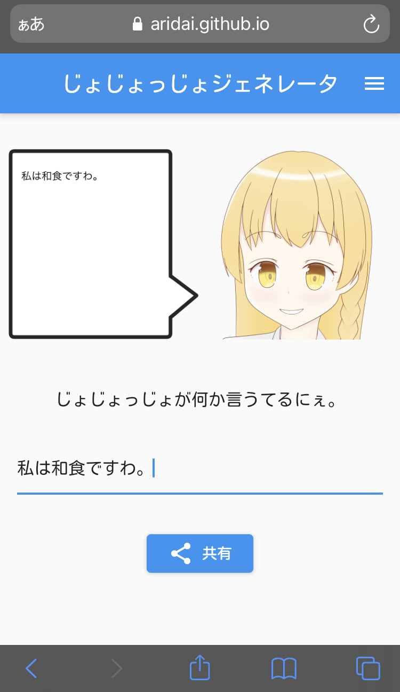

# じょじょっじょジェネレータ

https://github.com/aridai/jojojjo_generator  
https://aridai.github.io/jojojjo_generator/  

## 使用ライブラリ

[使用ライブラリ 一覧](LIBRARIES.md) のページにまとめて記載しています。  
ライブラリ作者の皆様に感謝いたします。 🙏

## コマンド

* 依存関係の復元
  * `flutter pub get`
* build_runnerの実行
  * `flutter pub run build_runner build --delete-conflicting-outputs`
* ビルド (Web向け)
  * `flutter build web --web-renderer canvaskit`
* フォーマット
  * `flutter format --set-exit-if-changed ./`
* 静的解析
  * `flutter analyze`

てすと
2